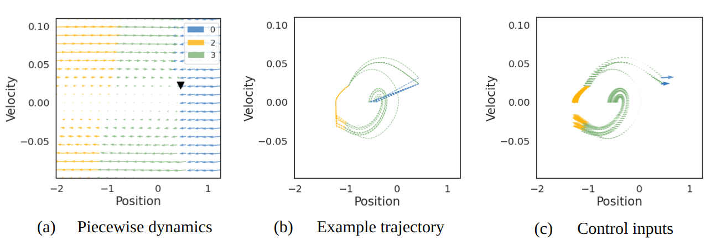
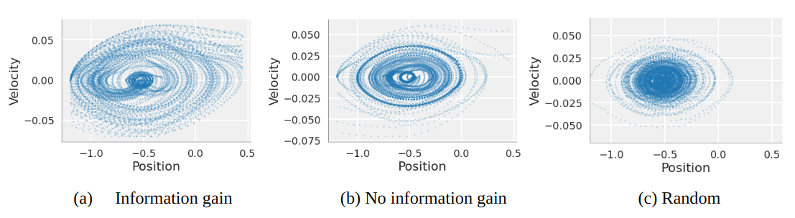
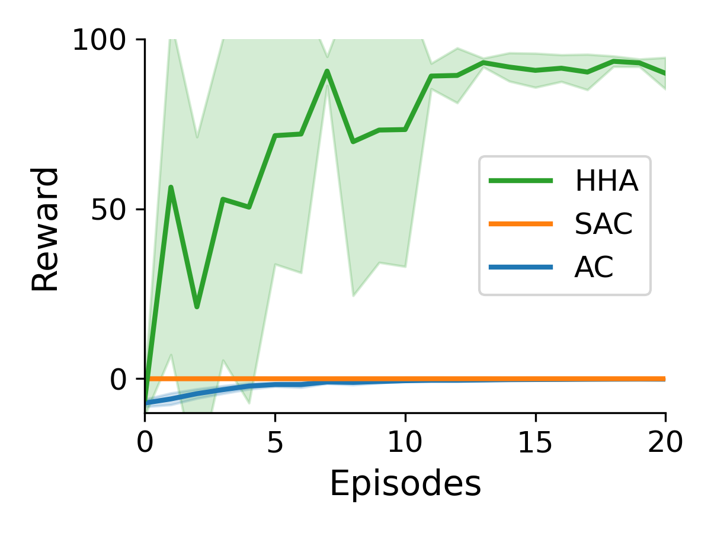

# Hybrid Control
Code for planning in hybrid models on classic control suite.

[link to paper](https://openreview.net/forum?id=956TTbUHt8)

**Abstract**
> An open problem in artificial intelligence is how systems can flexibly learn discrete abstractions that are useful for solving inherently continuous problems. Previous work has demonstrated that a class of hybrid state-space model known as recurrent switching linear dynamical systems (rSLDS) discover meaningful behavioural units via the piecewise linear decomposition of complex continuous dynamics \cite{lindermanRecurrentSwitchingLinear2016}. Furthermore, they model how the underlying continuous states drive these discrete mode switches. We propose that the rich representations formed by an rSLDS can provide useful abstractions for planning and control. We present a novel hierarchical model-based algorithm inspired by Active Inference in which a discrete MDP sits above a low-level linear-quadratic controller. The recurrent transition dynamics learned by the rSLDS allow us to (1) specify temporally-abstracted sub-goals in a method reminiscent of the options framework, (2) lift the exploration into discrete space allowing us to exploit information-theoretic exploration bonuses and (3) `cache' the approximate solutions to low-level problems in the discrete planner. We successfully apply our model to the sparse Continuous Mountain Car task, demonstrating fast systems identification via enhanced exploration and non-trivial planning through the delineation of abstract sub-goals.

## Recurrent switching linear dynamical systems 
We exploit recurrent switching linear dynamical systems allowing us to seperate control into high level planning through discrete variables and low level *reflexive* LQR control. 

## Exploration

Due to the small dimension of the discrete variables, which only capture non-linear behaviour, we can calculate information theoretic bonuses for exploration.

## Performance

The directed exploration allows the algorithm to solve sparse mountain car efficiently.

<!-- 

 -->
<!--  -->

## Installation
To setup use 
`pip install -e .` in the top level directory (where `setup.py` lives)
this will install `hybrid_control` as an editable package, which avoids the mess 
of relative imports and python paths.